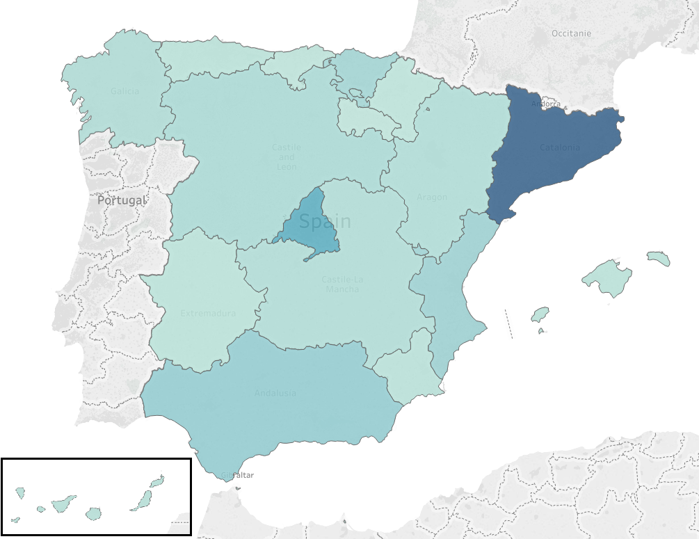

# Spanish Job Market

Spanish job market during weeks 43-44 of 2018.

 This work is licensed under a <a rel="license" href="http://creativecommons.org/licenses/by-nc-sa/4.0/">Creative Commons Attribution-NonCommercial-ShareAlike 4.0 International License</a>.

## Ofertes de treball a Espanya

> Distribució del nombre d'ofertes per comunitat, durant les setmanes 43-44 de 2018.

## Introducció

Amb aquest projecte extreurem les ofertes de treball llistades a la web oficial de l'estat espanyol i les transformarem en un dataset que pot ser utilitzat per estudiar les característiques de la oferta laboral espanyola.

## Descripció del dataset

Aquest data set proporciona els següents camps (entre altres):

- Descripció de la oferta
- Titulació necessària
- Lloc de treball (ciutat, comunitat, país)
- Salari
- Tipus de jornada
- Data de la oferta
- Web a on s’ha publicat la oferta
- Categoria

Aquestes dades s'han recollit durant les setmanes 43-44 de 2018 fent servir un procés de web scraping sobre el portal de treball que proporciona el govern espanyol, [empleate.gob.es][1].

Es pot trobar informació més detallada sobre la seva utilització a la wiki del projecte:
https://github.com/amilan/spanish_job_market/wiki

Com advertencia, s’ha de dir que les dades han estat publicades tal qual s’han obtingut de la font, és a dir, per tal del seu tractament posterior es recomana aplicar un procés de neteja de les dades.

## Agraïments

Aquestes dades són facilitades pel __Servicio Público de Empleo Estatal__ i com podem llegir a la seva política de privacitat:

> Utilitzación de la información contenida en la Web.
>
> El Servicio Público de Empleo Estatal facilita la consulta libre y gratuita de la información contenida en la Web, permitiendo la copia y distribución de páginas siempre que se citen la fuente y la fecha en la que se ha realizado la copia, no se manipulen ni alteren los contenidos y no se utilice directamente con fines comerciales.

En aquest cas farem un ús merament acadèmic, les fonts de cada oferta estan incloses a la mateixa fila que la oferta i a més a més distribuirem les dades amb llicència CC BY-NC-SA 4.0 License ja que es la que millor s’adapta a les demandes de la política de privacitat de la web originaria. Per més detalls sobre aquesta llicència consultar [creativecommons.org][2].

També cal dir, que al no aplicar un procés de neteja sobre les dades, no estem modificant les dades obtingudes, així que en aquest apartat també estem complint amb la política de privacitat.

## Inspiració

La inspiració per portar a cap aquest projecte es la de facilitar una millor comprensió de l'estat laboral a Espanya.

Aquestes dades poden servir per fer diferents estudis sobre el mercat laboral a l'estat Espanyol. Algunes idees d'ús serien:

- Analitzar els diferents requeriments professionals que tenen les diferents autonomies d'Espanya.
- Identificar el tipus i la qualitat del treball actual al país.
- Analitzar les regions amb més i menys ofertes de treball.
- Analitzar la distribució de les diferents professions en funció de la regió.
- Ajudar a la creació d’un pla per potenciar el mercat laboral basat en el coneixement obtingut a través de les dades.

També es podria expandir el data set amb informació sobre el cost de la vida per tal de donar una visió sobre a quina part d'Espanya rendeix més un mateix salari.

## Llicència

Aquestes dades han estat extretes de la web [empleate.gob.es][1] i com comentem amunt, les dades son públiques sempre que es compleixin les condicions esmentades. Per tal motiu, aquests dades les oferim sota la llicència CC BY-NC-SA 4.0 License.

Podem consultar els seus detalls en la següent URL: https://creativecommons.org/licenses/by-nc-sa/4.0/

Aquesta llicència permet:

- Compartir: l’ús, copia i redistribució de les dades
- Adaptació: barrejar, transformar i construir sobre les dades

Sota els següents terminis:

- Atribució: S’ha de donar crèdit al creador o creadors, proporcionar un enllaç a la llicència, i indicar si s’ha fet algun canvi sobre les dades.
- Ús no comercial: no es permet l’ús comercial d’aquestes dades
- Compartir: si les dades es modifiquen o s’utilitzen per crear nou material, aquestes s’han de distribuir sota la mateixa llicència.

Com podem veure, aquests terminis s’adapten a la perfecció als requeriments de la política de privacitat comentada amunt.

## Referències

- https://empleate.gob.es/empleo/#/
- https://creativecommons.org/licenses/by-nc-sa/4.0/
- https://empleate.gob.es/empleo/#/trabajo?search=*&pag=0

[1]: https://empleate.gob.es/empleo/#/
[2]: https://creativecommons.org/licenses/by-nc-sa/4.0/

## Bibliografia

- Subirats, L., Calvo, M. (2018). Web Scraping. Editorial UOC.
- Lawson, R. (2015). Web Scraping with Python. Packt Publishing Ltd. Chapter 2. Scraping the Data.

Altre documentació utilitzada:
- Beautiful Soup documentation. [data de consulta: 04 de Novembre de 2018] - <https://www.crummy.com/software/BeautifulSoup/bs4/doc/>
- Pandas documentation. [data de consulta: 04 de Novembre de 2018] - <http://pandas.pydata.org/pandas-docs/stable/>
- Python documentation. [data de consulta: 04 de Novembre de 2018] <https://docs.python.org/3/>
- Requests. [data de consulta: 04 de Novembre de 2018] <http://docs.python-requests.org/en/master/>
